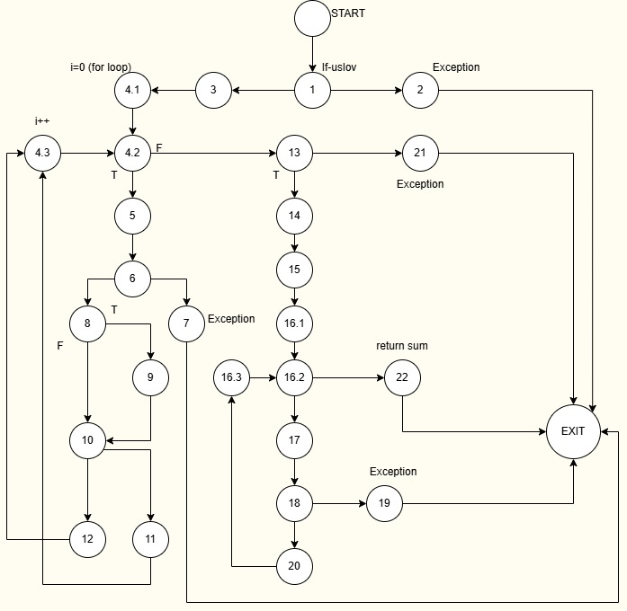

# Нина Додиќ 233169

## Control Flow Graph

## Цикломатска комплексност

Цикломатската комплексност ја одредуваме преку формулата P+1. Променливата P претставува број на предикатни јазли односно јазли каде што се донесува некоја одлука т.е има некој услов. Во овој код P=8, па така цикломатската комплексност е 9.

## Тест случаи според критериумот Every statement

Со Every Statment методата целта е секоја линија од кодот да биде извршена барем еднаш преку некој тест случај. За оваа метода минимален број на тест случаи кои ни се потребни е 6.
	4.1 List == null // allItems==null 
	Доколку листата е null тогаш ќе добиеме исклучок "allItems list can't be null!". Со 	овој тест случај е опфатен првиот if-услов од кодот.
	4.2 InvalidName==null // item.getName()==null 
	Ако имаме предмет со невалидно име тогаш се добива исклучок 	RuntimeException("Invalid item!") и на овој начин е покриена линијата за проверка 	на име.
	4.3 Discounted item (item.getDiscount>0)
	Ако за вредност на discount, има број поголем од 0 се влегува во if условот во кој 	се намалува sum независно од тоа дали другите услови во if-от се исполнети 	бидејќи станува збор за операција "ИЛИ".
	4.4 Item without discount - Ако условот item.getDiscount>0 не е исполнет, т.е за 	discount се земе број <=0 , тогаш се влегува во else делот и се извршуваат 	соодветните наредби за пресметки од кодот.
	4.5 Invalid card Number - Со ваков тест случај за невалидно име на картичка ќе се 	добие RuntimeException("Invalid card number!") и ќе биде изминат else делот од 	соодветниот услов.
	4.6 Invalid character in card number - Во овој тест случај картичката има 16 	карактери, но барем еден е невалиден (на пример буква). Ова го активира for-loop 	каде што се проверува секој карактер дали е цифра. Ако не е, се фрла 	RuntimeException("Invalid character in card number!").

## Тест случаи според критериумот Multiple Condition

За Multiple Condition критеруимот, мора да ги покриеме сите можни комбинации кои водат кон различни исходи од условот.Во нашиот случај треба да ги покриеме сите комбинации на логички вредност за дадениот услов. Бидејќи во условот има операција 
"или" ,па затоа доволно е да се користат 4 тест случаи,3  во кои барем еден од составните услови ќе биде true и еден во кој сите составни услови ќе бидат false.

| Price > 300 | Discount > 0 | Quantity > 10 | Услов             |                      Објаснување                         |
|-------------|---------------|--------------|-------------------|--------------------------------------------------------- |
|      T      |       F       |      F       | Исполнет          |Првиот составен услов е вистинит па целиот услов е true   |
|      F      |       T       |      F       | Исполнет          |Вториот составен услов е вистинит па целиот услов е true  |
|      F      |       F       |      T       | Исполнет          |Третиот составен услов е вистинит па целиот услов е true  |
|      F      |       F       |      F       | Исполнет          |Ниеден од условите не е исполнет, целиот услов е false    |
